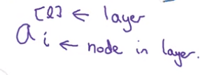
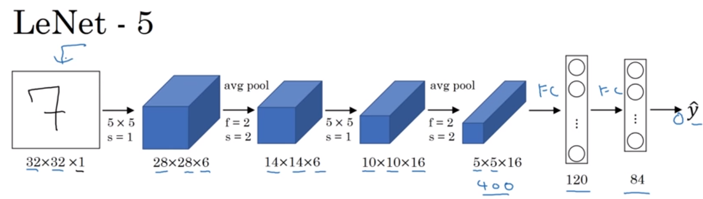
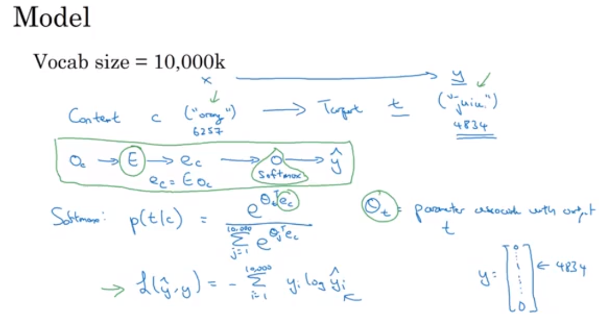

# Blogs

## Contemporary 
  * [Inflation Hedging Strategy from MSCI](https://github.com/znaixian/Blogs/blob/master/Contemporary/Inflation%20Hedging%20Strategy%20from%20MSCI.md)
  * [Factor Strategies from MSCI by Viewing - MSCI USA LOW SIZE INDEX](https://github.com/znaixian/Blogs/blob/master/Contemporary/Factor%20Strategies%20from%20MSCI%20by%20Viewing%20-%20MSCI%20USA%20LOW%20SIZE%20INDEX.md)
  * [Momentum Strategies by Looking at MTUM and PDP](https://github.com/znaixian/Research/blob/master/Contemporary/Momentum%20Strategies%20by%20Looking%20at%20MTUM%20and%20PDP.md)
  * [Corporate Bond ETF - LQD and HYG](https://github.com/znaixian/Research/blob/master/Contemporary/Both%20Are%20Corporate%20Bond%20ETFs%2C%20Why%20LQD%20Is%20Better%20Than%20HYG.md)
  * [Factor Based Bond ETF - ANGL and PHB](https://github.com/znaixian/Research/blob/master/Contemporary/Factor%20Based%20Bond%20ETF%20-%20ANGL%20and%20PHB.md)
## Industry
  * Business Services
  * Consumer
    * Internet Department Store
    
  * Energy
  * Finance
    * [Cryptocurrency Trading and Exchanges](https://github.com/znaixian/Research/blob/master/Industry/Cryptocurrency%20Trading%20and%20Exchanges.md)
    
    * Insurance
    MIT prof.Gary Gensler put out a course on FinTech Disruptions, the new technologies are disrupting the financial services industry—driving material change in business models, products, applications and customer user interface. Amongst the significant technological trends affecting financial services into the 2020’s, the class will explore AI, deep learning, blockchain technology and open APIs. Students will gain an understanding of the key technologies, market structure, participants, regulation and the dynamics of change being brought about by FinTech.
    It's break down is
    - AI and ML
    - AI in Finance
    - Open API and marketing chaneels
    - Blockchain & Crypotocurrencies
    - Payments
    - Credit and Lending
    - Challenger Banks
    - Trading and Capital Markets
    - Insurance
      

    - Coronavirus and Finance


  * Healthcare
    * [Seattle Genetics](https://github.com/znaixian/Research/blob/master/Industry/Seattle%20Genetics%20Good%20Time%20To%20Buy(2016).md)
  * Industrials
  * Technology
  * Utilities


## REITs
 * [REITs in the US]()
 

## China Theme
  * [China Theme ETFs](https://github.com/znaixian/Research/blob/master/China%20Theme%20ETFs.md)
  * [China Dividend ETFs](https://github.com/znaixian/Research/blob/master/China%20Dividend.md)

## Thailand Theme
  On a higher level, Thailand SET (180532) serves as a broad benchmark for Thailand stock market. The performance in the past twenty years is as below. It has over 600 constituents.
  

  BlackRock has constructed an ETF iShares MSCI Thailand ETF (THD) in 2008. It holds 112 stocks as of November 20, 2020. According to etf.com, "THD is the only pure Thai ETF and it's a good one. The fund tracks our broad Thai segment benchmark, making for a near perfect representation of the market. THD's sector splits are spot-on, with financials and energy taking up more than 1/2 of the portfolio. The Thai market is very concentrated, so investors should be mindful that representative exposure in Thai equities translates into high concentration risk. THD sees respectable daily trading activity across small spreads, though we still advise the use of limit orders. Creation or redemption of shares might cause movement in the underlying market, however. THD charges a somewhat high fee for a single-country fund, but tracking is very tight and securities lending recaptures some of that expense for investors. Overall, THD is the place to go for exposure to Thailand." The performance of THD is highly correlated to however lackluster compared to SET benchmark:
  
  THD's composition is tilted toward larege cap. with an average weighted market cap of $9.83 billion.
  Industry break down shows 
  

  In terms of asset management, there are 277 Thai equity mutual funds of which 90% are active and only 10% are passive.(referenced from  Become a Better Investor | May 29, 2020).

  With above brief analysis, we can tell there are significant opportunities to create indexing products and passive investment products.

  Using FactSet Screening, we found 744 stocks listed in BKK exchange, among them, 87 companies' marekt cap is greater than $1 billion, 184 greater than $250 million. Given the liquidity requirements for constructing passive investment products such as ETF, this 184 can be our initial universe. 
  
  The industries of Thailand has clear concentration on the following sectors out of 184 base universe number:
  Finance                   48
  Consumer Non-Cyclicals    23
  Utilities                 20
  Non-Energy Materials      20
  Consumer Cyclicals        15
  Industrials               12
  Healthcare                10

  Thailand is still a developing country but is growing with rapid pace. According to wiki, Thailand had a 2017 GDP of US$1.236 trillion (on a purchasing power parity basis). It has advantage in exporting goods and services especially benefited from the ASEAN Free Trade Area (AFTA). More recently, Thailand is also part of Regional Comprehensive Economic Partnership(RCEP),help find a market for many of its goods and service via this free trade agreement. 
  
  Hence, to take full advantage of the prosperous outlook of Thailand companies, one approach is to leverage Factset GeoRev data to find companies obtaining revenues from ASEAN (Singapore, Malaysia, Philippines and Indonesia) already. 

  The other angle is to create "heathcare" themed fund as Thailand's healthcare is quite advanced. 

  

## Technology Innovation

## Bond Index and ETF
  * [Liquidy Mismatch Between the Corporate Bond ETFs and the Underlying Securities Can Cause Mispricing](https://github.com/znaixian/Research/blob/master/Liquidy%20Mismatch%20Between%20the%20Corporate.md)
  * [China Bond ETFs](https://github.com/znaixian/Research/blob/master/China%20Bond%20ETFs.md)


---
# Computer Science Basics Agnostic of programing languages
## CS50 C Memory 
Heap or buffer corruption and Stack overflow
```
#include <stdio.h>
int main(void)
{
  char *s #give an address/pointer for a char variable in the memory
  printf("s: ");
  scanf("%s", s);
  printf("s:  %s\n", s);
}

void swap(int *a, int *b)
{
  int tmp = *a;
  *a = *b;
  *b = tmp;
}
```
deferencing intuitively I understand it as referncing 
pointer pointing to a space in memory, then given a value, pointer deference to the space, there are three elements, can pass one particularily pass the address out
in real main function, swap(&a, &b), meaning to swap values, you want inputs being address of the two variable, then swap itself(see codes above) will make sure the function goes to the right address, then swap the space stayed in those address (*a = *b, not just *a or *b means the value stored there not addrss anymore, while int *a or int *b mean the adress value in integer form) 

## Data Structure and Algorithm
What is algorithm, it involves finding the suitable models such as graphs and applying generic techniques such as divide and conquer, greedy and dynamic programming to solve problems in programmatic way. 
To measure algorithm, we all know big O for asympototic complexity
searching and sorting in arrays: binary search, insertion sort, selection sort, quick sort and merge sort
Graphs and graph algorithms
* represent a graph
* directed acyclic graphs
* shortest paths, spanning trees

heaps/priority queues
search trees union of disjoint sets (union find)

How to represent graph, in terms of implementation, we can use adjacency list and adjacency matrix with adjacency list is more space thrift, but adjacency matrix does have vital usage in certain problems. 


> reference books - algorithm design Jon Kleinberg and Eva Tardos
Algorithms by Sanjoy Dasgupta


## Graph Theory
* check out this full course William Fiset
  [Graph Theory by William Fiset](https://github.com/williamfiset/Algorithms)
* represent a graph
  * map as an example no adjacent area has same color
* directed acyclic graphs
* shortest paths, spanning trees

> Dijkastra's shortest path algorithm is an example of greedy approach, the procedure is as follows:
let distance of start vertex from start vertex = 0
let distance of all otehr vertices from start = inifinity
then repeat the following steps:
 - visit the unvisited vertex with the smallest known distance form the start vertex
 - for the current vertex, examine its unvisited neighbours
 - if the calculated distance of a vertex is less than the known distance, update the shortest distance
 - update the previous vertex for each of the updated distances
 - add the current vertext to the list of visited ertices
untill all vertices visited

A* Pathfinding Algorithm is basically an optimized form of Dijkstra's shortest path algorith for a weighted, undirected graph. It's widely used in games, nlp, financial trading system and space exploration such as below:


To figure out following the steps depicted as


Graph theory application is wide including
- navigation systems
- web page links
- data transmission
- social networks
- fluid dynamics
- critical path analysis
- 3D modeling
- games and simulations


### problems solved by graph theory
* air travel (https://www.youtube.com/watch?v=cY4HiiFHO1o)
* topological sort DAG
* 

## Trie
Trie data structure comes from the word "Retrieval". Unlike structures such as linked list, heap, stack, binary tree etc, Trie is created to sort words.  
Usage of Trie is commonly known such as autocomplete feature in searching field, simple letters retrieved a whole set of similar words. 

For a pair of fly | 6, instead of applying simple hash key | value pair, in Trie, you use a stack of 26 letter composed array and extend node by node downstream until it hits and end, then allot the value here is 6. Once it hit the value, the word is complete.


With this structure, it's easy to do search, insert, delete a word. Back to Google searching example again, here is the snippet to accomplish "prefix word autocomplete" searching
```
class Trie(object):
    
    def __init__(self):
        """
        Initialize your data structure here.
        """
        self.children = [None]*26
        self.isEndofWord = False

    def insert(self, word):
        """
        Inserts a word into the trie.
        :type word:str
        :rtype: None
        """
        curr = self
        for in in word:
            index = ord[i]-ord('a')
            if curr.children[index] == None:
                curr.children[index]=Trie()
            curr = curr.children[index]
        curr.isEndofWord=True
```

## Binary Tree
Construction of binary tree (from https://www.youtube.com/watch?v=GSbLeELeEGM&list=PLTd6ceoshprdS7HVI-Yus4rAHtrqNzH0j&index=13 channel name is computer science)
Searching binary tree basically is following the same steps of contructing a binary tree to check if a value exists or not

Traversing a binary tree is also known as walking the tree, systematically visit each node in the tree, any node with children is the root of a subtree, traversal is best done recursively, there are three depth first traversal strategies:
- pre-oder
- post-order
- in-order

Object oriented implementation of a binary tree, the tree is defined as a class, and its insert metod allows a binary tree to be built by creating node objects from a node class.

Applications of binary trees (from Stackoverflow)
Binary Search Tree - Used in many search applications where data is constantly entering/leaving, such as the map and set objects in many languages' libraries.
Binary Space Partition - Used in almost every 3D video game to determine what objects need to be rendered.
Binary Tries - Used in almost every high-bandwidth router for storing router-tables.
Hash Trees - used in p2p programs and specialized image-signatures in which a hash needs to be verified, but the whole file is not available.
Heaps - Used in implementing efficient priority-queues, which in turn are used for scheduling processes in many operating systems, Quality-of-Service in routers, and A* (path-finding algorithm used in AI applications, including robotics and video games). Also used in heap-sort.
Huffman Coding Tree (Chip Uni) - used in compression algorithms, such as those used by the .jpeg and .mp3 file-formats.
GGM Trees - Used in cryptographic applications to generate a tree of pseudo-random numbers.
Syntax Tree - Constructed by compilers and (implicitly) calculators to parse expressions.
Treap - Randomized data structure used in wireless networking and memory allocation.
T-tree - Though most databases use some form of B-tree to store data on the drive, databases which keep all (most) their data in memory often use T-trees to do so.
The reason that binary trees are used more often than n-ary trees for searching is that n-ary trees are more complex, but usually provide no real speed advantage.

In a (balanced) binary tree with m nodes, moving from one level to the next requires one comparison, and there are log_2(m) levels, for a total of log_2(m) comparisons.

In contrast, an n-ary tree will require log_2(n) comparisons (using a binary search) to move to the next level. Since there are log_n(m) total levels, the search will require log_2(n)*log_n(m) = log_2(m) comparisons total. So, though n-ary trees are more complex, they provide no advantage in terms of total comparisons necessary.

(However, n-ary trees are still useful in niche-situations. The examples that come immediately to mind are quad-trees and other space-partitioning trees, where divisioning space using only two nodes per level would make the logic unnecessarily complex; and B-trees used in many databases, where the limiting factor is not how many comparisons are done at each level but how many nodes can be loaded from the hard-drive at once)


## Dynamic Programming
  * Fibonacci sequence
  * Task optimization problem recursive approach taking down step by step
    
    Or task like this summation of non-neighbors to be maximum
    
    The Recursive approach would be
    ```
    arr = [1, 2, 4, 1, 7, 8, 3]
    def  rec_opt(arr, i):
        if i == 0:
            return arr[0]
        elif i == 1:
            return max(arr[0], arr[1])
        else:
            A = rec_opt(arr, i -2) + arr[i]
            B = rec_opt(arr, i-1)
        return max(A, B)

    rec_opt(arr, 6)
    ```
    The Dynamic programming approach is 
    ```
    #dynamic programming bottom up approach
    @timer
    def dp_opt(arr):
        opt = np.zeros(len(arr))
        opt[0] = arr[0]
        opt[1] = max(arr[0], arr[1])
        for i in range(2, len(arr)):
            A = opt[i-2] + arr[i]
            B = opt[i-1]
            opt[i] = max(A, B)
        return opt[len(arr)-1]
    dp_opt(arr)
    ```

## Gate Lecture

## Compiler Desgin(https://www.youtube.com/watch?v=Qkwj65l_96I&list=PLEbnTDJUr_IcPtUXFy2b1sGRPsLFMghhS)

## Networking hardware(https://www.youtube.com/watch?v=XaGXPObx2Gs&list=PLowKtXNTBypH19whXTVoG3oKSuOcw_XeW&index=1)

## Distributed Computer System (https://www.youtube.com/playlist?list=PLawkBQ15NDEkDJ5IyLIJUTZ1rRM9YQq6N)

## Introduction to Cryptography (https://www.youtube.com/playlist?list=PL6N5qY2nvvJE8X75VkXglSrVhLv1tVcfy)

## MIT 6.006 Introduction to Algorithms, Fall 2011 (https://www.youtube.com/watch?v=Zc54gFhdpLA&list=PLft0IIgWjn_HodQ4pGMsBWcMsG5ri5ufx)
- algorithm thinking - peak finding, there are all kinds of algorithms
  - Kadane's algorithm to find the max substring in a string of numbers
    O(n) approach rather than brute-force one
    
    then it's further applied to solve Maximum Sum Rectangular Submatrix in Matrix
  - System Design Parking lot system design problem (object oriented approach) design patterns (top-down and bottom-up)  
  


- sorting & trees(binary trees)  - event simulation, sorting has wide application: data compression, sort and find duplicates, find the word and frequency respectively
computer graphics
  - insertion sorting, then binary insertion sorting and merge sort (binary insertion sort employs a binary search to determine the correct location to insert new elements, and therefore performs ⌈log2 n⌉ comparisons in the worst case, which is O(n log n). The algorithm as a whole still has a running time of O(n2) on average because of the series of swaps required for each insertion.)
  As to the complexity measurement, the theta of merge sorting is picturized as 
  
  one advantage of insertion sort over merge sort, merge sort needs theta() auxiliary space while in place sort has theta(1) auxiliary space.
  to measure complexity, there are big O for upper bound , omega for lower bound and theta in the case when both coincide, here is the math view:
  
  - heap sort
  - AVL trees and AVL sort, first AVL trees require heights of left and right children of every node to differ by at most +-1, so they are mostly balanced; AVL insert can be deployed in these steps: simple BST insert, then fix the AVL property, here is an example:
  
  

  Comparison models, all input items are black boxes, ADTs, only operations allowed are comparisions, time cost is just hte number of comaprisons

  Decision tree only comparison algorithm can be viewed as a tree of all possible comparisons and their outcomes, and resulting answer, here is an example

  - Dynamic Programing at MIT, there are five easy steps of Dynamic Programming (DP), think of it as a carefully brute force, guessing recursion + memoization, or it is shortest paths coputation in some DAG(direct acyclic graph), get to treat recursive calls as theta(1), or exactly the concept of amortization.
  5 "easy" steps to DP:
  1. define subproblems
  2. guess part of solution
  3. relate subproblem solutions with recurrence
  4. build an algorithm or build up DP from bottom-up
  5. solve the original problem
  latex use dp for text justification, while microsoft's greedy way is not optimal, the latex way is: text = list of words; badness(i through j as a line words[i:j].

- hashing - genome comparison, hashing is widely used in database indexing, compilers, cashing, password authentication , and more.

  Hash table in database indexing to solve the linear calculation to fetch data
  for example, if we apply an algorithm or function to transfer a value to an index number, it's constant time complexity to fetch
  
  Hashing Algorithm or Hashing function must produce unique hash value, impossible to produce same hash value, hashing speed is also important, finally hashing should be secure.
  Also we can think of the index number as the memory address, address = key Mod n
  It's avoidable that there will be collision, so the assignment has to be pushed, one way to push it is called linear probing,i.e. probing the nearest location linearly. 
  Another way to deal with collision is chaining or closed addressig, it's also the concept of linked list in python:

  In blockchain technology, hash function is applied: Genesis blcok with unique hash, then add it to the new block, repeat on and on.

  In actually coding, when we need to have a condition on whether the key is available, a naice way like below is not optimal:
  
  The optimal - speed-up way is
  


- numerics - RSA encryption

- graphs - rubik's cube
  grapth algorithm by Tushar
  - topological sort graph algo
  - dijkstra's algo single source
  - prim's algo minimum spanning tree graph algo
  - Kruskal's algo mnimum spanning tree graph algo
  - Disjoing sets using union by rank and path compression graph algo
  - Traveling salesman problem dynamic programing held-karp
  - Bellman-Ford Algo single source shortest path graph algo
  - Strongly connected components Kosaraju's algo graph algo
  - Floyd Warshall Algo All pair shortest path graph algo
  - Detect Cycle in Directed Graph Algo
  - Ford Fukerson Algo Edmonds Karp Algo for Max Flow
  - Cycle in Undirected Graph Graph Algo
  - Articulation Points 
  - Johnson's Algo - all simple cycles in directed graph


  prerequisite knowledge - binary heap 
  - computer logic
  
  - what is binary heap
  - bloom filter 
  - Dekker's Algorithm dealing with the race condition
  - pagerank algorithm employ random surfer model, and there is a damping factor 85% will stay on the random, then switch to other sets of pages
  - 


  1. A topological sort for a DAG is a linear ordering of vertices such that for every directed edge (u, v), vertex u comes before v in the ordering. Directed acyclic graphs are used in many applications to indicate the precedence of events. The steps are illustrated as 
   

  2. Prim's Algorithm Minimum Spanning Tree Graph Algorithm
  3. Kruskal's algorithm Minimum Spanning Tree Graph Algorithm
  4. 
   

- shortest path - caltech to MIT
  1. Dijkstra's algo single source shortest path graph algo

- dynamic programming - design technique bottom up applied on image compression

- advanced topics - complexity theory


Application of Crytography is wide spreading across 
- GNU GPG 
- Truecrypt
- Secure shell remote file transferring
- plug-in for thunderbird
- S-MIME email
- cell phone
- HDCP multimedia prot
- Bank cards
- VPN
- e-Passport
- online banking
- iPod itune
- e-book kindle

Set-up for symmetrical cryptography (simple) problem namely communication over insecure channel

>Kerckhoff's Principle [1883]
change the rules of the game, a cryptosystem should be secure even if the attacker (Oscar) knows all the details about the system, with the exception of the secret key. 

Substitution cipher
remarks: historical cipher; operate on letters not on bits and bytes; idea is to replace every plain text letter by a fixed ciphertext letter

using brute force to attack might be computationally impossible, so the alternative could be counting letter frequency and figure out the real letter disguised by other letter, in sum, the classificaiton of crypto attacks are:
there are often many possible attack approaches(attack vectors)
cryptoanalysis contains classical crypotoal. which contains brute-force and analytical attacks, other branch is social engineering(Bribe a bank official to obtain the secret key, or fish password), the third category is called implementation attacks, for example, bank card has that goldern square with side channel anlaysis to extract the keys unless it's masked well. 

Lecture2 modular arithmetic and historical ciphers
Definition of modula operator


Now an equivalence class formed for modulo 5, all membersof the class behave equivalent modulo 5. There is a profound application of this concept - equivalence class, 


Rings: an algebraic view on modular arithmetic


## Ultimate goal - Similarity two months time frame to complete
  * simple concepts such as Euclid, Manhatton, Cosine and Jaccid similarities 
  * AI based semantic similarity analysis
  * NLP
  * Netflix recommending system
  1. Research Paper Recommendation System for Netflix, authored by Leidy Esperanza Molina and Prof.Dr.Sandjai Bhulai.
  
  There are many algorithms to perform recommendation system, for instance, popularity, collaborative filtering, content-based filtering, hybrid approaches.

  Popularity is straightforward. 
  
  Collaborative filtering(CF) algorithms are based on the idea that users with similar rating history tend to behave consistently in the future. Based on information about similar users or similar items, the CF could be classified into two different approaches: 
  - Memory-based techniques 
    - user based collaborative filtering
      There is a wide variety of metrics to compare similarity between vectors or to find the closest neighbor (in our case users). The most popular are Cosine Similarity or Pearson Correlation
      for example, for the following matrix of users and products
       
      
  
    - item based collaborative filtering
      It is quite similar to user based collaborative filtering except the underlying object is not user but movie

  - Model-based techniques.
    Model-based technique is different than Memory-ased technique in the sense that it aims to build a model to improve the results of CF and find patterns in data. Model-based techniques are based on Matrix factorization (MF), an unsupervised learning method for dimensionality reduction. By the way, there are multiple traditional ways to perform dimensionality reduction such as Principal Component Analysis (PCA), Singular Value Decomposition (SVD), Probabilistic Matrix Factorization (PMF), Matrix completion Technique, Latent Semantic methods, and Regression and Clustering (Isinkaye, Folajimi, and Ojokoh, 2015)

  - Content-based(CB) filtering
    It not only considers similarity by rating but also learns the user preferences, and then locate or recommend items that are "similar" to the user preferences, i.e. content-based.
    The data must be structured, where each item is described by the same set of attributes in the form of a feature vector y. The core of this approach is to create a model of the user’s preferences based on those feature vectors.Techniques are applications of information retrieval such as Term Frequency (TF) or Inverse Document Frequency (IDF) (Salton, 1989), and some machine learning techniques including Naive Bayes, support vector machine, decision trees, among others.
    Common problems such as "cold start problem" and "popularity bais problem" in CF will no long be a big issue in CB

    -  Term-Frequency - Inverse Document Frequency (TF - IDF)
    -  Probabilistic methods Naive Bayes SVM Decision Trees


  - Hybrid Approach
    The hybrid methods are characterized by combining CF and CB techniques

  2. LinkedIn course by Frank Kane (https://www.linkedin.com/learning/building-recommender-systems-with-machine-learning-and-ai/install-anaconda-review-course-materials-and-create-movie-recommendations?u=88123954)
   
    - Learning objectives
      Top-N recommender architectures
      Types of recommenders
      Python basics for working with recommenders
      Evaluating recommender systems
      Measuring your recommender
      Reviewing a recommender engine framework
      Content-based filtering
      Neighborhood-based collaborative filtering
      Matrix factorization methods
      Deep learning basics
      Applying deep learning to recommendations
      Scaling with Apache Spark, Amazon DSSTNE, and AWS SageMaker
      Real-world challenges and solutions with recommender systems
      Case studies from YouTube and Netflix
      Building hybrid, ensemble recommenders
    
  ### Top-N recommeder architectures
  Metric for top-n recommenders that accounts for the rank of predicted items - ARHR (average reciprocal hit rank). 
  
  RecommenderMetrics.py

  ### Recommender Engine Framework
  AlgoBase contains SVD, KNNBasics, SVDpp and Custom

  ### Content Based filtering
  - content-based recommendations and the cosine similarity metric
  equation on cosine similarity on multi-dimensions
   versus
  
  - K-nearest neighbors(knn) and content recs
  - producing and evaluating content-based movie recommendations 
  - bleeding edge alert: Mise-en-scene recommendations
  - Diver deeper into content-based recommendations
 
  ### Neighborhood-Based Collaborative Filtering

  ### Matrix Factorization Methods
  - PCA is a dimension reduction algorithm and Random Forest a feature ranker. PCA craete new features called principal components that are ranked based on the magnitude of variation. Dimension reduction is independent of the class label, although, feature ranking depends on the class type. It is intuitive that, for example, we choose people with strong legs for a running competition (class label), while the important feature for a boxer (class label) is having strong hands. So does the feature ranking algorithm.
  
  An eigenvector or characteristic vector of a linear transformation is a nonzero vector that changes by a scalar factor when that linear transformation is applied to it. The corresponding eigenvalue, often denoted by, is the factor by which the eigenvector is scaled.
  - Singular value decomposition(SVD)


  ### Apache Spark
  

  1. Another course which applies KNN, nearest neighbor ()


  ## NLP by Andrew Ng (https://www.youtube.com/watch?v=n1l-9lIMW7E&list=PLpFsSf5Dm-pd5d3rjNtIXUHT-v7bdaEIe&index=2)
  What is the applications of supervised learning
  
  audio temporal sequence data we often use RNN, language translation often RNN, photo tagging use convolutional neural network(CNN), realestate online adverstising we use standard Neural network.

  Activation function using Relu instead of sigmoid made the gradient descent work much faster, this algorithm innovation helps computation much more faster or efficient. Iterative cycle on the base of large set of data, so the speed is essential to do at least fast experimenting on practical sense. 

  ### binary classification problem
  Logistic regression, not commonly known linear regression, is for binary classificaiotn problem. 
  Using cat image identificaiton as example, we define feature vectors is composed of 64X64x3(RGB three primary color scheme)=12288 feature vectors, or nx. 
  first is to lay out the notation clearly, note if run python shape, the output is nx feature vectors, m columns.
  

  Define loss (for single instance) and cost function (collectively across the whole training set)
  
  The goal is to find the optimal w and b (weight and bias parameters) to minimize the cost function by gradient descent iterations.

  Further digging on logistic regression cost function of the design ingenuity
  

  ### neural network
  First, be very familiar with the connotation
  

  Vanishing/exploding gradients problem manifest in deep networks, the partial solution is to initialize the weights, take a sinle neuron as an example
  
  Then apply this approximation to do gradient checking for potential bugs
  

  On practical level, do not use gradient checking in traiing only to debug, if the algo fails grad check, loot at components to try to identify bug. And don't use dropout, after chceking, turn on dropout again, and don't forget regularization:
  
  
  In big data era, which is particularily fitful for neuron network, there is a problem of computing complexity if everything is done in one hit, hence, there is this "mini batch gradient desecent" approach, which taking apart the whole m examples to say m/1000 batches, run each in a pass through then average to get cost or loss funtion J. Note in NN, there is this notion called epoch, which basically is a pass-through the training set. In mini-batch approach, there could be multiple epochs within one mini-batch gradient descent, accomplished by applying for loop. 
 
  Choosing mini-batch size has two extremes, one is direct batch gradient descend or stochastic gradient descent, where every example is own mini-batch. One batch GD is very time consuming, and stochastic GD is very low-efficient, so something in between is ideal in fast learning.

  Exponentially weighted averages, Vt = beta*Vt-1 + (1-beta)Thetat, which is approximately average over 1/(1-beta)days temperature. It's a key component of several optimization algorithms. Usually beta set to be .9, it takes about 10 days/iterations to get to 1/e, or less than one third of the weight one. Bias correction in exponentially weighted average. There is algo called Gradient descent with momentum, to unpack, it's intuitively understandable via the following diagram:
  

  RMSprop algo root mean square prop also can speed up gradient descent, avoid huge oscillation, basically you want to slow down the vertical direction, but stride wider on horizontal. Adam optimization algorithm, unlike most other algos that do not generalize that well, over time, stand out as useful. 

  Why you wan to implement "learning rate decay", mini-batch gradient descent, it's wandering around might cause never converge in the end, if you were to slowerly slowly decay the learning rate, steps taken are smallers, hence the oscillation is smaller, so it can finally converge. Recall one epoch is one pass-through the data,  if we apply the following formula, on each epoch, a decaying different alpha is applied.
  

  So there are multiple ways of hyperparameter setting, ranging from alpha, beta1, beta2, epislon, number of layers, number of hidden units, learning rate decay and mini-batch size,  so we'd have a systematic way to process tuning. Some are more important such as alpha - learning rate, then comes beta (weighting schema) and mini-batch size. 

  Using an appropriate scale to pick hyperparameters, first you choose at random, then applied maybe logirhized random zones instead of linear evening out. 

  Batch normalization adding batch norm to a network
  
  Why does Batch Norm work? Covariance shift, if the distribution of x changes, you need to retrain with more comprehensive datasets. Batch norm set the parameters of beta and gama firm ground to stand on. It speeds up but may have unintended regularization problem. 

  We'll need a multiple classifier for multiple features, then the tool is softmax regression.
  

  Further, to understand softmax, see the equations below
  

  Softmax regression generalizes logistic regression to C instead of 2 classes, if c is 2, the output is two numbers only, since they add up to 1, so the other value is redundant. 

  The problem of local optima, because of there are a greate number of dimensions or features, the gradient descent doesn't work it's way down to the bottom of convex as you wish, more probably, it will be like a saddle shape. 

  TensorFlow is a framework of deep learning, here is a snippet to minimize a function. 
  ```
  import tensorflow as tf
  coefficients = np.array([[1.],[-20.],[100]])
  w= tf.Variable(0,dtype=tf.float32)
  x= tf.placeholder(tf.float32, [3,1])
  # cost = w**2 - 10*w + 25
  # cost = x[0][0]*w**2 + x[1][0]*w + x[2][0]
  train = tf.train.GradientDescentOptimizer(0.01).minimize(cost)
  init = tf.global_variabe_initializer()

  session = tf.Session()
  session.run(init)
  print(session.run(w))

  # session.run(train, feed_dict={x:coefficients})
  for i in range(1000):
      session.run(train, feed_direct={x:coefficients})
  print(session.run(w))

  #idiomaticly replacing these three lines with
  with tf.Session() as session:
  session.run(init)
  print(sessionrun(w)
  ```

  ### ML strategies
  Orthogonalization is the principle so we can tune each knob seperately
  Using a single number evaluation metric, first, we need to grasp the two major metrics, one is the precision which is straightforward, the other is recall rate, which means of all the actual objects, say cat recognition classifier, what is the percentage of correctly recognized. 
  Sometime the two metrics contradict each other, so we developed a third compbinational metric called F1 score, which is the harmonic average of the two. 
  How to set up an optimizing and satisfying single number metric?
  If there are accuracy and runnig time in cosideration, as long as the runnign time is less than 100ms, we call it satisfying, under which, we want to optimize the accuracy. 

  Avoidable Bias, human level error as a proxy for Bayes error (the maximum one can achieve), difference between human error and training error to be avoidable bias, one can aim to reduce, so we can use this terminology to measure. 

  End-to-end deep learning, take speech recognition as an example, from audio to transcript, used to carry out in different stages, but end-to-end bypassing these intermediate steps and reach to the end transcript directly. cons of end-to-end learning requirement a large amount of data, exclude potentially useful hand-designed components.

  Covolutional Neural Network involves concepts of edge detectio, filter (withe operation sign looking like multiplication but actually means convolute) padding, strided, volumes, pooling, max poolings. 
  An example is
  

  Classical networks 
  LeNet-5
  

  Resnets to train very very deep netwrks, it's residual block. Why ResNet works? 
  Attention model intuition, developed for machine translation, very influential paper. 

  ## Tensorflow Application
  apparel recognition
  mnist numeric recognition
  movie review positive and negative

  ### reference real life case studies
  - GE Healthcare to assist MRI operator
  - Liulishuo to evaluate student 
  - Tweeter ranking tweets with Tensorflow (highlight the benefits of tensorflow compared to pytorch, specifically split network, warm start and thriving econsysmtem of tensorflow) 
  - Coca-Cola use ML to enable mobile proof-of-purchase
  - Airbnb to categorize pictures
  - Suggesting presets for image editing in VSCO
  - Intelligent office based ML for WPS
  

  * document similarity document distance 
    * measure of document similarity
    

    * basic concept can be visualized as below
    
    It is an OK measurement but what if it's a lenghty document so all words shown up, modification is needed - divided with product of length of both documents
    
    Now there is an algorithm can be developed for compute
    algorithm step1 split doc into words, step2, cmpute word frequencies, step3, compute the dot product

    * relevant measure, text classificaiton, TF - term frequency thing of it as word count
    * IDF - inverse document frequency
    * log(no of documents in teh a corpose/no of documents that contain the term) 
    * TF-IDF
    the concept of TF-IDF is actually straightforward illustrated as below
    
    * 

  ### the concept of dimensional group
    * simple dimensions using RBICS with Revenue to count each subsidiary company as an independed entity
    * abstract dimensions such as hydrogen, ocean, molecular biopharm, green energy requires TEXT processing  

  ### upgrade from similar companies to related companies
  - Because notion of similar companies is quite straightforward using classification system. We should not over complex the problem 
  - The actual complex problem is to identify "related" companies that are inconspicous. For example, Uber and Lyft are not typical taxi companies but still allocated as such, Amazon and Pingduoduo are not in conventional retailing business but they are mapped to be peers to Macy's or Walmart. We need to come up with additional dimensions to define or depict these new relatedness.
    - In above two examples, we can single out the layer or dimension of "infrastructure technology"; 
    - EV concept can be employed by conventional car manufacturers. This layer of "technology" is similar to above item but worth listing our seperately as we can apply a systematic NLP sort of approach to identify them;

    > refer to this systematic course from Derek https://www.linkedin.com/learning/advanced-nlp-with-python-for-machine-learning/leveraging-the-power-of-messy-text-data?u=88123954)
    The essence of NLP is to find a way to mathmatically represent sementic or textual information.
      - TF-IDF
      - word2vec
      - doc2vec
      - Recurrent Neural Network
    Andrew Ng's explanation is superb (https://www.youtube.com/watch?v=jQTuRnjJzBU&t=137s)
    1. word embeddings 
    
    The features such as gender, royal, age, food etc forms multiple dimensions to define a word such as Man, which is embedded in the abstract dimensional space and can be mathmatically calculated.
    Embeding Matrix looks like
    
    instead of conducting matrix matrix multiplication composed of mainly zeros, we should use specialized function such as Embedding layer in Keras to look up an embedding efficiently. 
    Input context words to predict target word, using simpler context word approach "word2vec"
    - skip-grams
    
    downside is the computational cost is too high
    one way to speed up is to apply hierarchial softmax classification
    - A more effective way to speed up is negative sampling, one positive example such as "orange juice", find K negative examples for softmax logistic regression. How do you sample these negative examples, one thing is to sample according to empirical frequency, or uniformly random, both has disadvantages. The author taks heuristic sample meaning some where in between the above two.
    - Next, more simple algorithm in NLP community is GloVe word vectors (global vectors for GloVe)
  
  
  - For companies founded by same people such as Fiveer (crowdsourcing labor) and Lemonade (insurance), that's another layer;
  - Common layers such as location, capital, number of employees are also considered.
 
  ### Broaden to the concept of "comprehensive company profiling" for expanded clients such as insuracen, investment banking, credit analysis...

  ## That means more layers/dimensions should be introduced, among which, the number one of course if the underlying text mining, the rest extends on credit score, debt status, accounting numbers etc.


## Interesting topic by Erik Demaine on Geometric Folding Algorithms 
## Leetcode codeforces

## Coding Tips and Methods
  * Python built-in algorithm from MIT 6.006 Introduction to Algorithms, Fall 2011
  understanding at this level of depth help to write efficient and fast Python codes

  * Python numpy broadcasting 
  the principle is as 
  


  * Python dictionary magic
  Dictionay can store the variable and grab in a constant 1 complextiy
  

  * debugging 
    * reproduce the bug locally not spending time communicating with server 
    * use print statement effectively
    * use debugger effectively
  
  * problem solving breakthrough
    * brute force solution
    * try simple example
    * use visualization
    * dictionary to store values
    * 


  * coding phases
    * phase 1
    * phase 2 基础都了解透了之后，才恍然大悟，之前学的并不入门，如果不能把基础理解透，只是比着葫芦画瓢，并不能举一反三，只有真正掌握透语法，原理才能让你举一反三，以不变应万变。顿时感觉自己开悟了。强化理解，让我入门了，从此掌握了学习编程语言的真谛的感觉，醍醐灌顶。说到这里，其实挺羡慕现在的人学习编程的，因为太方便了，不像我们那个年代网上学习资料和课程都很少，需要自己研究，慢慢啃，现在网上的教学课程都很系统，资料也特别多。
    * phase 3 阶段三就是从源码和开源入手，掌握编程的翅膀。其实，像编程语言基础的语法，数据结构，算法这类东西，还有一些计算机原理之类的知识，这些东西都是编程和实践的根本。他们看似枯燥和基础，但是具有最长久的生命力。这是我开悟的第一层真谛。 我自学 Android 的时候，慢慢渐入佳境，突然有一天我要实现一个非常炫酷的效果的时候，在网上搜了很久，都没有找到解决办法，直到看到一篇文章在讲源码，要自定义 View ，就要看 View 类的源码，看看里面有哪些事件和方法，你要重写这些事件或者方法，就可以实现自己想要的效果。然后自己下载了 Android 源码开始研究看看 View 里到底藏着什么东西？在大二，那是我第一次用 Source Insight（查看源码的工具），看完之后，一步一步的研究，里面到底是什么？慢慢的啃，知道什么意思之后，就自己开始尝试，最后通过继承和重写把自己想要的结果实现了，才发现自己的编程正在突飞猛进


## Physics
  * 微积分
    * https://mp.weixin.qq.com/s?__biz=MzIzODU2MzAyNg==&mid=2247484886&idx=1&sn=9f7f035c2051d8eb38546f20d91c027c&chksm=e9363e6bde41b77d6e89be56f1c4ebaf73b67d26488ff7d59c2061ff85c2d440ae311aa6d913&scene=178&cur_album_id=1337882199491936256#rd
  * Algebra 
  * 麦克斯韦方程组（积分篇）
  * 麦克斯韦方程组（微分篇）
  * 如何从麦克斯韦方程组推出电磁波？
  * 相对论前夜：牛顿和麦克斯韦的战争
  * 相对论诞生：爱因斯坦是如何创立狭义相对论的？by 长尾科技
  * 宇称不守恒到底说了啥？杨振宁和李政道的发现究竟有多大意义?
  * 杨-米尔斯理论说了啥？为什么说这是杨振宁超越他诺奖的贡献？
  
  ## Law of Human Behavior
    * needs based understanding
    * facts vs. opinions
    * leadership replicable asking 6 questions
    * practical middle manager guide by Dedao
    * cognitive ability  
    * Mini Habits schedule 5:15am workout writing punch line habits
  
  ### practical middle manager guide by Dedao


  ## Cumulatoin harvesting compounding return
  * writing thinking coding writing
  你要想尽一切办法从「一份时间只能出售一次」升级到「同一份时间可以重复出售很多次」
  商业能力这个东西，是非常泛、非常含混的概念，甚至到最后可以无所不包。智商可以是商业能力的一部分，情商可以是商业能力的一部分，写作能力可以是商业能力的一部分，演讲能力可以是商业能力的一部分，组织能力可以是商业能力的一部分，领导能力也可以是商业能力的一部分，甚至，趋势研究思考能力也同样可以是商业能力的一部分…… 但，有一个重要的点，是最为基础的，了解了它，就算是「一下子入门了」：
  这事儿值得做很久吗？
  这是个趋势，这有很大的商业价值，并且，它还有长期积累的可能性……
  在这个趋势之中，做什么是效率最高收益最大的呢？
  穿透表象看透实质」的能力
  长期价值
  公平交易
  决策能力

  * 识别长期价值的能力
  
  * writing tool
  最简化工具箱 by Xiaolai 
  1. 工作室
我平日里的习惯是喜欢空旷的空间，所以，以前工作室里是尽量只有几样工作必须的东西，一切不必要的都会被我挪走…… 结果，在做直播探索的过程中，发现个非常痛苦的事情，就是房间里的回音太大，乃至于影响直播效果…… 疫情期间之后到现在一直不能装修（录音室装修是个相当专业细分的领域），所以，目前我只好采用了 “往房间里多堆一点东西” 的策略 —— 搞得我内心非常痛苦哈哈哈。不过，到最后也确实东西不少，比如，你无论如何都得搞一些柔光灯什么的……
  1. 工作台
我每天的工作中大部分都是在摆在走步机前的升降桌上完成的。写稿的时候，脚下走着，会不知不觉就走一两万步…… 这个疫情搞得，连开会都可以在走步机上 “远程” 语音了（顺带推荐 mornin.fm）。
  1. 摄像头
我前后测试了很多种视频输入方式，罗技的 4K 摄像头，iPhone 的前置和后置摄像头，甚至包括佳能 6D 相机…… 到最后发现，如果在推流的过程中，使用 800K 以上的视频比特率，那么，有些网络条件不好的观众就无法顺畅观看…… 并且，由于是讲课（而不是放电影），又由于我总是不需要也不应该把自己那张大肥脸摆满整个屏幕，所以，只要用 iMac 自带的摄像头就已经足够了。
  1. 麦克风
选择麦克风真的是一件非常不容易的事情，尤其是对我这种 “外行” 来说…… 买来高级麦克风之后，连接线都前后补了好几个订单才算是搞定。而后又在几个外接声卡之间做了很久的选择 —— 结果到最后，不曾想，直接用 Airpods 是效果最好的…… 因为 Airpods 在拾音过程中，降噪、消回音效果都相当不错（甚至更好）。
  1. 推流软件
直接使用手机直播，对老师来说是不现实的 —— 无论是横屏还是竖屏……
而推流软件实际上并没有什么可选，只有 OBS，官网是 https://obsproject.com/ ，经过一顿操作猛如虎的学习和比较之后，放弃了一切花里胡哨的东西，只用最基本的设置。（未来有些女老师很可能有 “开美颜” 的刚需，可惜，我实在没这个需求，所以也拿不出什么动力去研究如何在 Mac 上开美颜……）
  1. 绿幕
绿幕是好东西…… 由于 OBS 可以为视频输入源设置 “色度键滤镜”，所以就可以把人像后面的绿色背景过滤掉 —— 这一点很重要，因为屏幕就那么大一点点，人像太小了不好，人像太大了也不行…… 前后试了好几种布置绿幕的方法，后来干脆买了小米的窗帘电机，把一面墙做成了绿幕（像窗帘那样） —— 还可以用手机控制。
  1. iPad
在此之前，从来都觉得 iPad 的笔是非常鸡肋的玩意 —— 结果，最终发现，还是自己并没有找到的 “刚需场景”。听过我直播课的人都看到了，我是用 iPad 屏幕当作整场背景的，如此这般，没有什么视觉展示辅助工具比 iPad 更好 —— 它简直啥都能干，没有局限…… F*ck 屁屁踢。
  1. Papper App
在 iPad 上，被我主要用来做视觉辅助的 App，是一个叫做 **Paper** 的应用。它本来是用来画画、涂鸦的，被我当做了 “黑板”…… 效果非常惊艳。
  1. Sketch App
课前的海报，都是我自己做的，也花不了几分钟…… 找张图，写个文案，做个二维码…… 仅此而已。所以，有一个趁手的图形设计工具很重要 —— 我用的是 **Sketch App**，简单、好用，其实又并不太贵……
  1.  团队
现在的我，在直播讲课这件事儿上没有啥 “团队”，只有我自己。将来有机会、有必要的话，会需要至少一个助手…… 有助手的话，就可以做 “多机位”、“导播” 等工作 —— 基本上，一个电视节目可以做的事情，在家里都可以做，只是有没有必要而已。

我们做了个在线收费直播工具，这个工具起点是为我自己做的 —— 实在没办法，因为市面上找不到正好是我需要的东西…… 并且我还没啥 “做平台” 的欲望。不过，若是有哪位老师有兴趣自己在网上开大课，可以联系我（后台留言，或者发邮件 lixiaolai@gmail.com），我可以琢磨一下如何帮忙。没有流量的人，先去攒流量，这事儿基本上没啥人能真正帮上你……​​​​
  * fe

